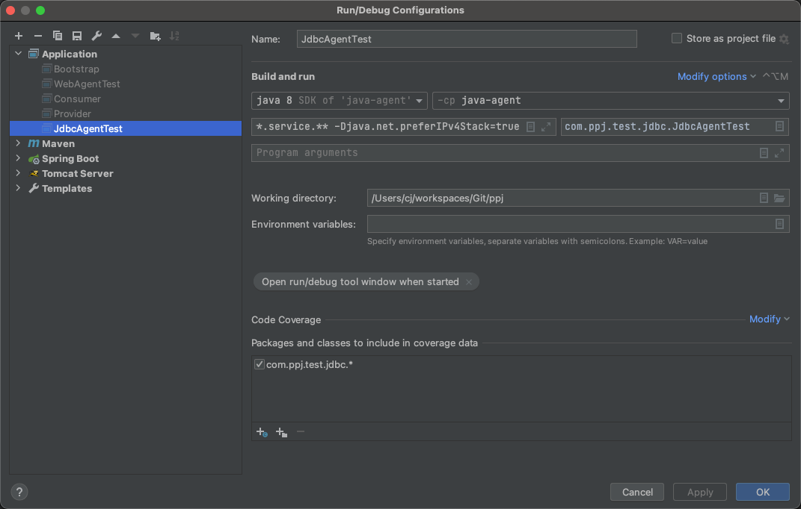

#javaagent学习
## 1. why?
这个项目是在我2019学javaagent的时候, 写的demo
## 2. how run test?
以com.ppj.test.jdbc.JdbcAgentTest

参数:
-javaagent:/Users/cj/workspaces/Git/ppj/java-agent/target/java-agent-1.0-SNAPSHOT.jar=com.ppj.agent.**.service.** -Djava.net.preferIPv4Stack=true
参数解释:
-javaagent:[这里是你的打的jar包]